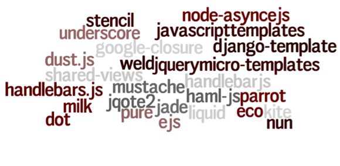
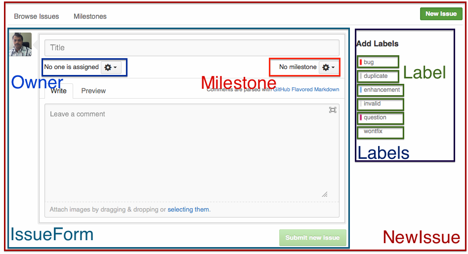

!SLIDE
# React JS #
## (Yet another) Javascript UI Framework ##
## from: Facebook, Instagram ##

!SLIDE bullets incremental
# Current Scenario #

!SLIDE bullets incremental
# Traditional #
* Rails, PHP, node.js => _html_
* jQuery

!SLIDE bullets incremental
# SPA #
* Rails, PHP, node.js => _json_
* backbone, angular, ember

!SLIDE bullets incremental
# React JS #
* View
* <del>models</del>
* <del>controllers</del>
* <del>bindings</del>
* <del>routing</del>

!SLIDE bullets incremental
# React JS #
* M_V_C
* The _V_ of MVC

!SLIDE bullets incremental
# View frameworks #

!SLIDE bullets incremental
# React JS #
* Give it 5 minutes
* _Components_ not Templates

!SLIDE bullets incremental
# Components #
* Separate your concerns

!SLIDE bullets incremental
# Components #

!SLIDE
# Creating Components #
    @@@ javascript
      Link = React.createClass({
        render: function(){
          return React.DOM.a(
              {href: '#'},
              {this.props.text}
            );
        }
      })

      React.renderComponent(Link({text: 'Home'}), document.body);

!SLIDE
# Creating Components #
# jsx #
    @@@ javascript
      /** @jsx React.DOM */

      Link = React.createClass({
        render: function(){
          return <a href='#'>{this.props.text}</a>
        }
      })

      React.renderComponent(<Link text='Home' />, document.body);

!SLIDE
# jsx compiles to... #
    @@@ javascript
      Link = React.createClass({
        render: function(){
          return React.DOM.a(
              {href: '#'},
              {this.props.text}
            );
        }
      })

      React.renderComponent(Link({text: 'Home'}), document.body);

!SLIDE bullets incremental
# REACT KEY CONCEPTS #
* Re-render entire app with every single update
* Just like the good old days (90's)

!SLIDE bullets incremental
# REACT KEY CONCEPTS #
## Virtual DOM ##
* In-memory data structure
* Optimized for performance and memory usage

!SLIDE bullets incremental
# ON EVERY UPDATE... #
* Build new Virtual DOM tree
* Diff with old one
* Compute minimal set of changes
* Batch render all changes to browser

!SLIDE bullets incremental
# REACT KEY CONCEPTS #
## Synthetic Events ##
* A cross-browser wrapper around the browser's native events
* Handles mouse, keyboard, touch events

!SLIDE bullets incremental
# REACT KEY CONCEPTS #
## Stack agnostic ##
* 28kb
* any MVC framework of choice
* jQuery

!SLIDE
# Thank you! #
* Girish Sonawane
* @girishso
* girish@cuberoot.in
* [Demo](http://jsbin.com/guzux/3/edit)

